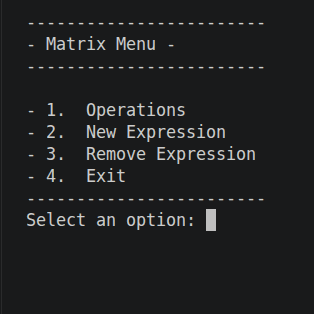
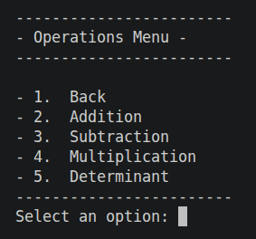

# Matrix Appication Project

## Arquiteture

### Project Overview

The project matrix application is a application in C++ responsable to process operations with matrices and interact with user through terminal. User through a Cli can choice a list of math operation with matrix to execut. 
The application uses some externa libraries like spdlog and nlohmann/json. 

## Code Structure
Main components:
- Interface Control of CLI application("app_hmi.cpp")
- Interface CLI ("HmiCli.cpp")
- Programming Control (app_progs.cpp)
- Matrix control application ("app_matrix.cpp")

### Organization

The application is organized in layers.

- **src/** - application with the main logic.
    - app_matrix - main application of the system. Responsable to start modules and other controls like CLI interface.
    - app_hmi    - control application responsable for the interface.

- **drv/** - drivers / abstraction of low level system to reduce the coupling  with the hardware.
    - drv_data_base - implement a abstraction layer to manage all things related with persistence of data in the memory system.
- **config/** - Read and management of configuration.
    - config_app_logger - store configuration of log system.
    - config_app -  store configuration related with application.
- **libs/** - internal libraries.
    - lib_expression - Implement function to analyse tokens, parse, and construct the tree of symbols to perform the math expression.
    - json - used to implement the data persistence of the system.  
    - lib_hmi - abstract class to allow do implement one or more system interfaces.
    - lib_matrix - implement operation between matrices.

## Linux Setup and Instalation

The project is developed in a distro Linux Ubuntu. 

### Cloning the project
---

To clone the project you will need the git instaled.
To instal git open a terminal and execute the command:

> $ sudo apt update

> $ sudo apt install -y git

Now clone the project

> $ git clone https://github.com/peresmauricio/c-c-plus-plus-developer-challenge.git

Enter in the project diretory:
> $ cd c-c-plus-plus-developer-challenge

Initialize and Update Submodules
> $ git submodule update --init --recursive

### Instalation of dependencies and tools

To install all tools and dependencies of the project execute the script "install_deps.sh".
Enter the project directory and run th script.
> $ ./install_deps.sh

## Compiling Project

To compile the project just execute the script "build.sh"
In the project folder execute the command:
> $ ./build.sh

## Generate Documentations

In the root of project there is a file named matrix_application_docs.conf. This file is the doxygen configuration file.
To create the documentation just execute the command:
> $ doxygen matrix_appication_docs.conf

The documentation will be created in docs/ folder.
To view the documentation artefact open the index.html in the docs/html/index.html using a browser application.

> $ firefox docs/html/index.html

## Unit Test
The unit test of the project was implemented using googleTest. The files are stored in ./unitTest.
To execute unit test of project just execute the script:
> ./build_unit_test.sh

## APIs/Libraries Useds

> [Lib json]    json library was used to implement persistency of system data in file. 
> [Lib spdlog]  Used to implement log system. 

## How to Use the System
After build the project, the executable file will be in build folder. 
To execute execute the command below
> ./build/matrix_application

### Main Menu
The system provide some basic operations in it's menu

1. **Operations** - 
2. **New Expression** - Allow user to construct a custom expression like A + B + C or A + ( B * C ).
3. **Remove Expression** - (Not implemented yet) - Allow user to remove some operation of the system.
4. **Exit** - Allow user to exit of the system. 

### Operations Menu

1. Back - Allow user to retorn to main menu.
2. Addition - Allow user to execute a addition operation.             Ex: A + B ( A and B are matrix )
3. Subtraction - Allow user to execute a subtraction operation.       Ex: A - B ( A nad B are matrix )
4. Multiplication - Allow user to execute a multiplication operation  Ex: A * B ( A nad B are matrix )
5. Determinant - Allow user execute a determinat calculation          Ex: det A

## Future Implementation

- Improve math and application rules to avoid errors.
- Improve the syntaxe analyses to accept determinant operations in a expression.
- Improve the syntaxe to accept token without spaces between it other.
- Improve the interface to show the results like a equation.
- Implement exclusion expression in the system.
- Improve unit tests to know limits of the operations.
- Implement a grafic interface.
- Implement a CI flow in the GITHUB to execute regression test.
